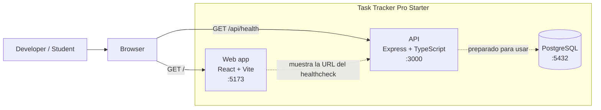
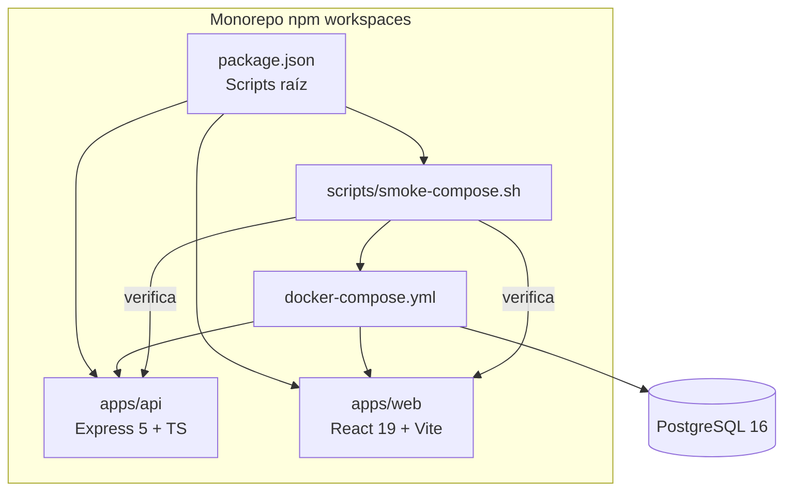
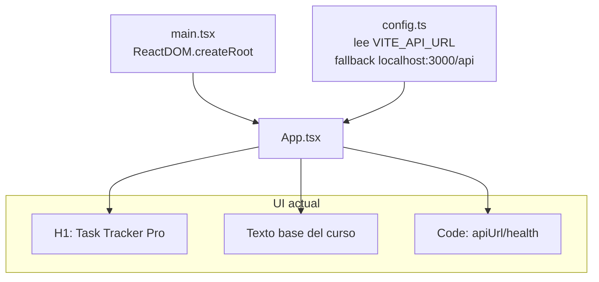
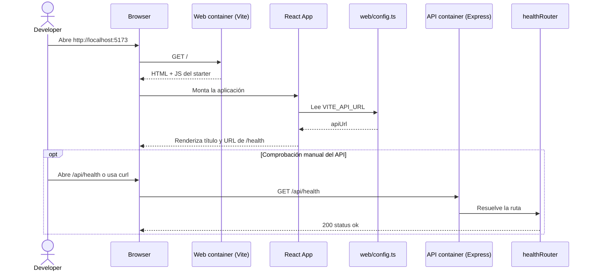
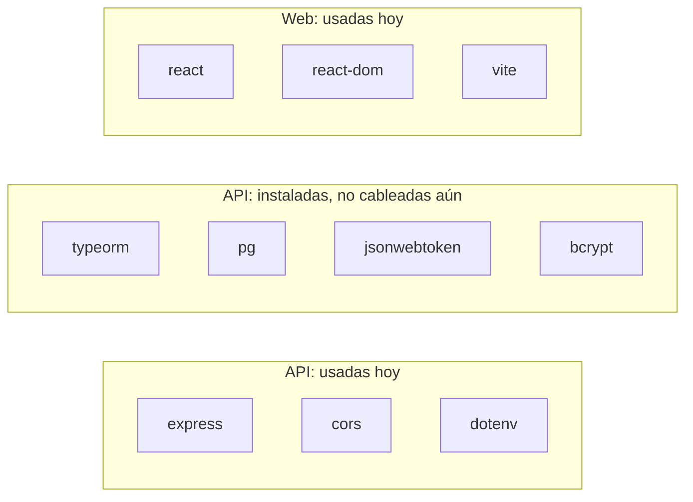
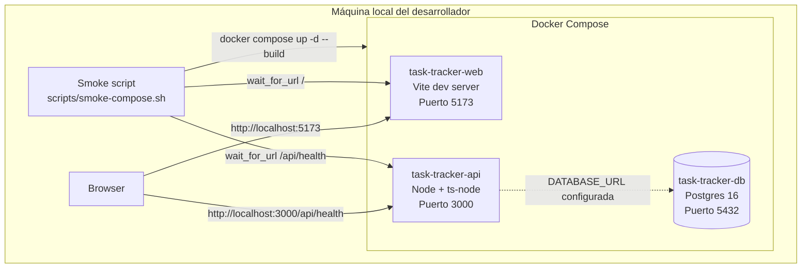

# C4 Diagram: Task Tracker Pro Starter

> Este documento describe el **starter real que existe hoy en el repositorio**. La visión más ambiciosa del curso vive en `README.md`, `ROADMAP.md` y el ADR `docs/adr/0001-jwt-authentication.md`, pero no todo eso está implementado todavía.

## Qué hace hoy, sin humo ni espejos

- La app backend expone **un único endpoint real**: [`GET /api/health`](../apps/api/src/routes/health.ts).
- La app web renderiza **una pantalla placehold<er** en [`apps/web/src/App.tsx`](../apps/web/src/App.tsx).
- `docker-compose.yml` levanta **web + api + postgres** para desarrollo local.
- La base de datos existe en el runtime local, pero **el código actual del API no la usa todavía**.
- Hay tests mínimos para comprobar que el starter responde y renderiza.

## Vista de contexto

El proyecto sirve como base de un curso de desarrollo asistido por IA. Hoy su comportamiento útil es validar que el entorno full-stack arranca correctamente y que la comunicación básica entre piezas está preparada.



### Lectura rápida

- El **usuario real ahora mismo** es quien desarrolla o sigue el curso.
- La **web no consume el API automáticamente**: solo muestra la URL configurada del healthcheck.
- El **API no consulta PostgreSQL** todavía, aunque el contenedor y la variable `DATABASE_URL` ya están preparados.

## Contenedores del sistema



### Qué aporta cada contenedor

- **Web (`apps/web`)**: servidor de desarrollo Vite en `5173`.
- **API (`apps/api`)**: servidor Express en `3000`.
- **DB (`postgres:16`)**: contenedor disponible para ejercicios posteriores; inicializa `infra/postgres/init.sql`.
- **Smoke test**: levanta todo con Compose y espera respuesta tanto de la web como del healthcheck.

## Componentes internos del API

La estructura real del backend es muy pequeña a propósito: una app Express con middleware básico y una ruta de salud.

```mermaid
flowchart TD
    main[main.ts\napp.listen(host, port)] --> app[app.ts\nExpress app]

    subgraph appflow[Pipeline HTTP del API]
        cors[cors()]
        json[express.json()]
        router[healthRouter]
        handler[GET /api/health\nresponde status ok]
    end

    config[config.ts\nhost, port, apiBasePath] --> main
    config --> router
    app --> cors --> json --> router --> handler
```

### Interacciones reales del API

1. [`src/main.ts`](../apps/api/src/main.ts) arranca el servidor con `config.host` y `config.port`.
2. [`src/app.ts`](../apps/api/src/app.ts) monta `cors`, `express.json()` y el router de health.
3. [`src/routes/health.ts`](../apps/api/src/routes/health.ts) registra `GET /api/health` usando `config.apiBasePath`.
4. La respuesta es siempre `200` con `{ "status": "ok" }`.

## Componentes internos del frontend

El frontend también está reducido al mínimo: monta React y renderiza una pantalla informativa con la URL del API.



### Qué hace de verdad la web

- Monta React desde [`src/main.tsx`](../apps/web/src/main.tsx).
- Lee `VITE_API_URL` desde [`src/config.ts`](../apps/web/src/config.ts).
- Renderiza contenido estático en [`src/App.tsx`](../apps/web/src/App.tsx).
- **No hace fetch**, no usa router, no tiene estado global y no llama al backend todavía.

## Secuencia principal de uso actual

Este es el flujo real más importante del starter: abrir la web y comprobar el endpoint de salud.



## Dependencias importantes, separadas por realidad actual



### Por qué este detalle importa

La documentación del curso habla de auth JWT, entidades y persistencia. Es correcto como **objetivo del roadmap**, pero el starter actual todavía no ha conectado esas piezas. Dicho de forma elegante: el garaje ya tiene herramientas, pero el coche aún está en modo chasis.

## Diagrama de despliegue local

No hay un despliegue productivo definido en código dentro de este starter. Lo que sí existe hoy es un **despliegue local con Docker Compose**:



### Notas de despliegue

- El contenedor `api` depende del `db` saludable.
- El contenedor `web` depende del `api`.
- Ambos montan el código fuente local como volumen para desarrollo.
- El smoke test destruye el stack al terminar y vuelca diagnósticos si algo falla.

## Cómo encajan las piezas

Si lo resumimos en una sola frase:

> Este repositorio es un **starter full-stack educativo** que hoy valida el arranque de un monorepo con React, Express y PostgreSQL, dejando preparado el terreno para añadir rutas reales, persistencia, autenticación y más componentes durante el curso.

## Dónde mirar según la pieza

- **Arranque API**: [`apps/api/src/main.ts`](../apps/api/src/main.ts)
- **Wiring API**: [`apps/api/src/app.ts`](../apps/api/src/app.ts)
- **Ruta real implementada**: [`apps/api/src/routes/health.ts`](../apps/api/src/routes/health.ts)
- **Test API**: [`apps/api/tests/health.test.ts`](../apps/api/tests/health.test.ts)
- **Arranque web**: [`apps/web/src/main.tsx`](../apps/web/src/main.tsx)
- **UI actual**: [`apps/web/src/App.tsx`](../apps/web/src/App.tsx)
- **Config web**: [`apps/web/src/config.ts`](../apps/web/src/config.ts)
- **Orquestación local**: [`docker-compose.yml`](../docker-compose.yml)
- **Smoke end-to-end**: [`scripts/smoke-compose.sh`](../scripts/smoke-compose.sh)
